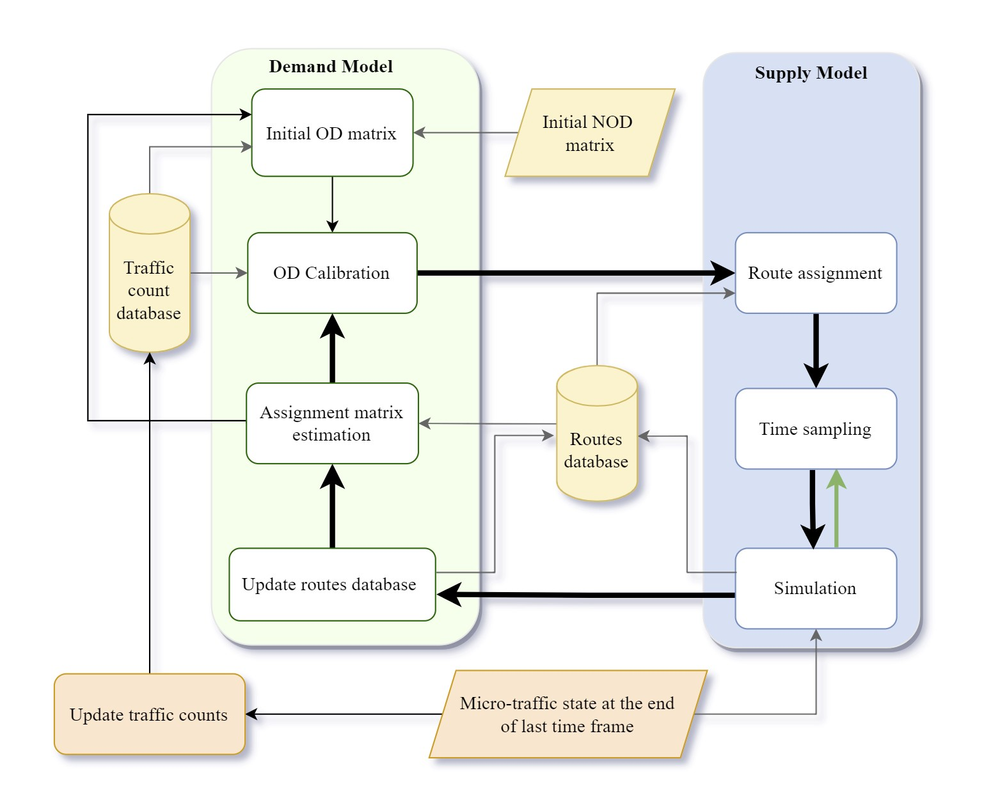

# Calibration Software for City-Scale Microscopic Traffic Simulation

## Installation

To install and run the calibration tool, follow these steps:

1. Clone the repository to your local machine:

        git clone https://github.com/Khoshkhah/ESTCalib.git

2. Install the required dependencies. You can use pip to install them:
pip install -r requirements.txt

## Usage

The calibration tool has to be started via calib.py, which is a command line application. It has the necessary following parameters:

1. -n network file address, that is a sumo network file.

2. -m the measurment filename contains sensor data. 
        it is a table file contains three columns "edge","count","interval" that are seperated by comma.

3. -dod the init distributed origin destination matrix filename.
        it is a table file contains five columns from_node,to_node,interval,weight_trip,trip_id
        that are seperated by comma.

4. -is the size of each interval in seconds. that is a integer number.

For more information of these input look at the sample grid in the [examples/grid](./examples/grid/) directory.

For getting the other optional arguments use the help command:

         python calib.py --help

Also for running the calibration tool, you can use a configuration xml file like [grid.cfg](./examples/grid/grid.cfg):

        python calib.py -c examples/grid/config.cfg

## High-level architecture of the calibration method

 

## Examples and Sample Data

We have provided examples and sample data in the [examples](./examples) directory. You can explore them to understand how to use the software effectively.

## Contact Information

For any questions, feedback, or inquiries, please feel free to reach out to us:
- Email: kaveh.khoshkhah@ut.ee

